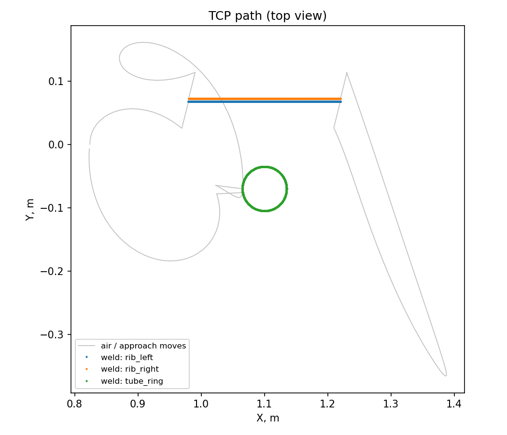
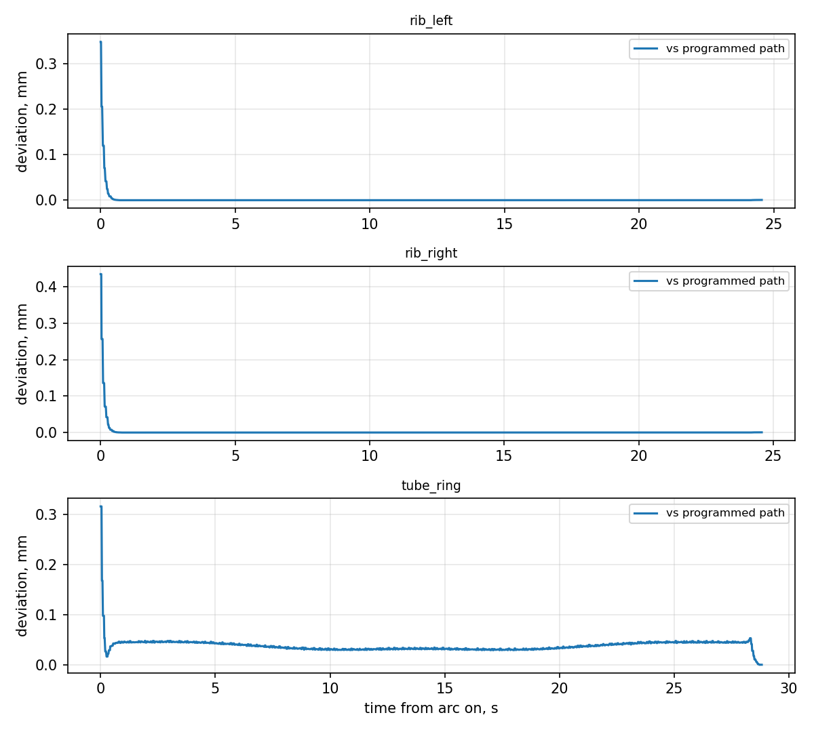

# weld-cell-sim

**Digital twin of a robotic arc-welding cell: HD Hyundai Robotics HDR20-17 + MoveIt 2 + ros2_control +
Gazebo Harmonic (ROS 2 Jazzy) in one Docker image.**



[Русская версия](README.ru.md)

## What is simulated

- **Cell** (`config/cell.yaml`): robot, welding table, part in a fixture (clamps, locators), power source,
  wire drum, torch-cleaning station, safety fence. The same file generates both the Gazebo world and
  the MoveIt collision scene.
- **Part**: a 4 mm sheet bracket: base plate, vertical rib and a tube boss.
- **Torch**: MIG/MAG, 45° swan neck, TCP at the wire tip (15 mm stick-out).
- **Weld program** (`config/weld_program.yaml`): three a3 fillet welds: `rib_left`, `rib_right`
  (straight, 240 mm) and `tube_ring` (370° around the tube). Per seam: current, voltage, travel speed,
  wire feed, work and travel angles.
- **Seam cycle**: PTP move (OMPL, collision-aware) → linear approach → arc ignition on "in position" →
  constant-speed welding (IK at every 1 mm) → crater fill → linear retract.
- **Visualisation**: nominal seams, bead coloured by cooling (white → orange → grey), arc and status text
  in RViz; bead and arc are also drawn in Gazebo.

## Results of a reference run

HDR20-17, nominal part: cycle ≈ 150 s, arc-on ≈ 78 s (≈ 51 %), TCP deviation with the arc on
RMS ≈ 0.02–0.05 mm, max < 0.5 mm, travel speed 9.9 mm/s at 10 mm/s commanded.



Every run writes `shared/logs/weld_<time>/`:
- `summary.json`: per seam length, commanded/measured speed, heat input Q = η·U·I/v, arc time,
  wire consumption, TCP deviation (mean, RMS, max); cycle time and arc-on ratio;
- `tcp_log.csv`: TCP pose and joints every 20 ms;
- plots: `tcp_path_top.png`, `tcp_deviation.png`, `tcp_speed.png`, `joints.png`.

## Quick start (Windows 11 + Docker Desktop / WSL2)

```bat
fetch_deps.bat   :: clone official HD Hyundai Robotics packages at pinned commits (hdr.repos)
build.bat        :: build the image stage by stage (checkpointed to backup\)
demo.bat         :: cell + full weld program (Gazebo and RViz windows)
start.bat        :: cell only; then run weld_demo.sh inside the container
```

```
start.bat [hdr20_17|hh020|hdr35_20] [--demo] [--headless] [--no-rviz] [--offset DX DY DYAW]
```

`--offset 0.002 0.001 0.5` shifts the **real** part in the fixture (m, m, deg) away from the nominal
pose the program was taught on, for studying the effect of part-position tolerances.

Inside the container:
```
weld_demo.sh                                   # all seams
weld_demo.sh -p seams:="['tube_ring']"         # one seam
weld_demo.sh -p speed_factor:=2.0 -p cycles:=3 # faster, several cycles
```

## Implementation notes

- Straight and circular seams use dense IK (`/compute_ik` every 1 mm) instead of `compute_cartesian_path`:
  in Jazzy the latter is time-parameterised by TOTG at ~0.1 s and loses the straight line.
- Zero velocity is enforced at dwell points, otherwise the joint trajectory controller's spline bulges.
- PTP moves are retried on MoveIt error −2; the Hyundai configuration recommends ≤ 20 % velocity scaling (10 % used).
- `tools/check_reach.py`: offline reachability check without ROS.

## Layout

```
Dockerfile, build.ps1          stages deps -> hdr-build -> final
hdr.repos, fetch_deps.bat      official HD Hyundai Robotics packages (pinned, not vendored)
ros2_ws/src/weld_cell/         cell package
  config/   cell.yaml, weld_program.yaml, controllers.yaml, kinematics.yaml, initial_positions.yaml
  urdf/     weld_cell.urdf.xacro (robot + torch + gz_ros2_control), welding_torch.xacro
  srdf/     MoveIt group "welder" (base_link -> torch_tcp)
  launch/   weld_cell.launch.py
  scripts/  weld_program.py (weld job), plot_weld_log.py
  weld_cell/ geometry.py (cell, seams, Gazebo world), report.py (metrics, plots)
scripts/   start_all.sh, weld_demo.sh, env.sh
tools/     check_reach.py
```

## Roadmap

- [ ] Part-offset study (`--offset`) and seam tracking (touch sensing / laser line)
- [ ] Other robot models (hh020)
- [ ] Hyundai HDC25-18 cobot once a public model is released

## Known issues

- While the Gazebo window is open through WSLg, the host "P" key may stop working; stopping the container
  fixes it. Use `--headless` as a workaround.
- A public model of the HDC25-18 cobot (25 kg / 1880 mm, July 2026) is not available, so HDR20-17
  (20 kg / 1742 mm) is used.

## License

BSD 3-Clause, see [LICENSE](LICENSE). The HD Hyundai Robotics packages are fetched from
[github.com/hyundai-robotics](https://github.com/hyundai-robotics) and keep their own BSD 3-Clause license.
This project is not affiliated with or endorsed by HD Hyundai Robotics.
